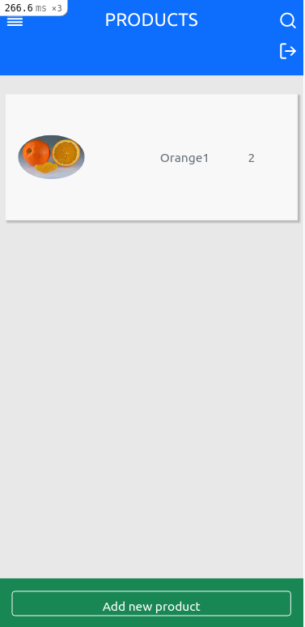

#ChosedName


> In this project the user can register and log in, so that the data is private. The user can introduce new transaction associated with a category and see the money spend on each category.



## Build With

- Ruby
- Ruby on Rails
- PostgreSQL
- SASS
- CSS
- Bootstrap

## Installation
```
  $ git clone git@github.com:SimonGrchevski/ChosedName.git

  $ cd ChosedName

  $ bundle

  $ rails db:create

  $ rails db:migrate
```

## Tested using
- Rspec

### Deploy using
- Heroku

## Demo
[live link](https://damp-brushlands-90418.herokuapp.com/)

## Special thanks

The design is based in the original work of [Gregory Vella](https://www.behance.net/gregoirevella)


## Author

👤 Simon Grchevski

- GitHub: [Github](https://github.com/SimonGrchevski)
- LinkedIn: [LinkedIn](https://www.linkedin.com/in/simon-grchevski-682935209/)
- Twitter: [Twitter](https://twitter.com/grchevski)

## 🤝 Contributing

Contributions, issues, and feature requests are welcome!

Feel free to check the [issues page](../../issues/).

## Show your support

Give a ⭐️ if you like this project!

## Acknowledgments

- Hat tip to anyone whose code was used
- Inspiration
- etc

## 📝 License

[](https://creativecommons.org/licenses/by-nc/4.0/)
[](http://creativecommons.org/publicdomain/zero/1.0/)
